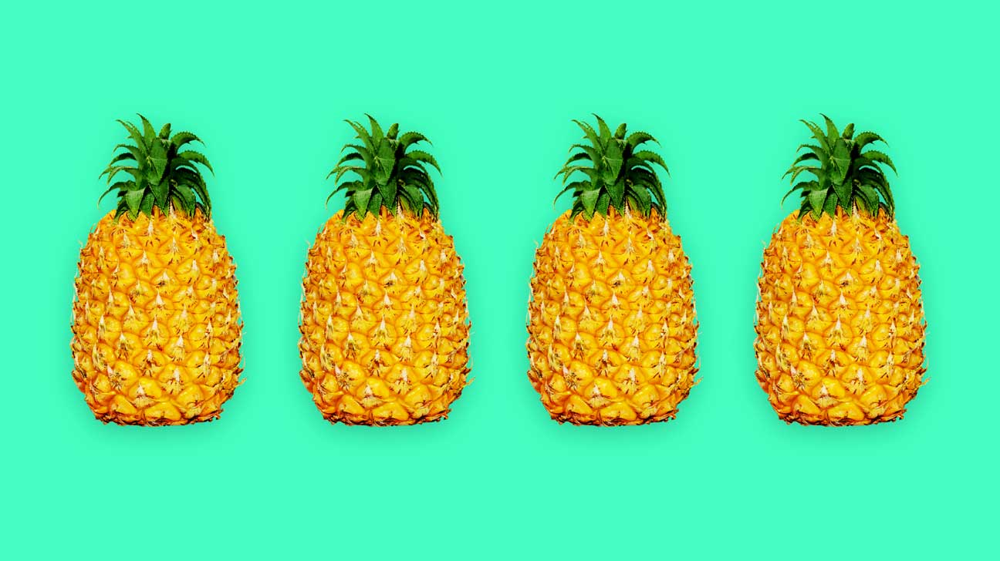

# PRONTO.jl

Hello and welcome to the julia implementation of the **PR**ojection-**O**perator-Based **N**ewton’s Method for **T**rajectory **O**ptimization (PRONTO).


# An Example
```julia
using PRONTO
using StaticArrays, LinearAlgebra
```
The wave function $|\psi(t)\rangle$ is a complex vector evolve in time $t$. We define our state vector $x = \begin{bmatrix}
Re(|\psi\rangle)\\
Im(|\psi\rangle) 
\end{bmatrix}$, and any complex square matrix $\mathcal{H}$ can be represented in its real form $H = \begin{bmatrix}
Re(\mathcal{H}) & -Im(\mathcal{H}) \\
Im(\mathcal{H}) & Re(\mathcal{H})
\end{bmatrix}$.

```julia
function mprod(x) 
    Re = I(2) 
    Im = [0 -1; 1 0] 
    M = kron(Re,real(x)) + kron(Im,imag(x)); 
    return M 
end

function inprod(x) 
    i = Int(length(x)/2) 
    a = x[1:i] 
    b = x[i+1:end] 
    P = [a*a'+b*b' -(a*b'+b*a'); a*b'+b*a' a*a'+b*b'] 
    return P
end
```

## Two Spin System
We consider the Schrödinger equation
$i|\dot{\psi}(t)\rangle = (\mathcal{H_0} + \phi(t)\mathcal{H_1})|\psi(t)\rangle,$
where $\mathcal{H_0} = \sigma_z = \begin{bmatrix}
0 & 1 \\
1 & 0
\end{bmatrix}$, and $\mathcal{H_1} = \sigma_y = \begin{bmatrix}
0 & -i \\
i & 0
\end{bmatrix}$ are the Pauli matrices. The control input $\phi(t)$ drives the system between 2 qubit states $|0\rangle$ and $|1\rangle$, which are the two eigenstates of the free Hamiltonian $\mathcal{H_0}$. 

```julia
function x_eig(i)
    H0 = [0 1;1 0]
    w = eigvecs(collect(H0)) 
    x_eig = kron([1;0],w[:,i])
end
```

We can name our model `Spin2`, where `{4,1,3}` represents the 4 states $x,|\psi\rangle$, the single input $u, \phi$ and the 3 parameters `kl, kr, kq`.

```julia
@kwdef struct Spin2 <: PRONTO.Model{4,1,3}
    kl::Float64 # stage cost gain
    kr::Float64 # regulator r gain
    kq::Float64 # regulator q gain
end
```

For this example, the control objective is to steer the system from the $|0\rangle$ state `x_eig(1)` to the target state $|1\rangle$ `x_eig(2)`. We can then define our terminal cost function $P(x(T))$ as 

```julia
function termcost(x,u,t,θ)
    P = I(4) - inprod(x_eig(2))
    1/2 * collect(x')*P*x
end
```

We convert the the Schrödinger equation
$i|\dot{\psi}(t)\rangle = (\mathcal{H_0} + \phi(t)\mathcal{H_1})|\psi(t)\rangle$ into the system dynamics $\dot{x}(t) = H(u)x$

```julia
function dynamics(x,u,t,θ)
    H0 = [0 1;1 0]
    H1 = [0 -im;im 0]
    return mprod(-im*ω*(H0 + u[1]*H1) )*x
end
```

For this example, we only consider the use of energy during the process, and we define our incremental cost
```math
\int_0^T l(x,u,t) dt
```
as

```julia
stagecost(x,u,t,θ) = 1/2 *θ[1]*collect(u')I*u
```

### Regulator
```julia
regR(x,u,t,θ) = θ.kr*I(1)

function regQ(x,u,t,θ) 
    x_re = x[1:2] 
    x_im = x[3:4] 
    ψ = x_re + im*x_im 
    θ.kq*mprod(I(2) - ψ*ψ')
end

PRONTO.Pf(α,μ,tf,θ::Spin2) = SMatrix{4,4,Float64}(I(4) - α*α')
```

We have finished defining our model! Now it is the time to generate the model so PRONTO can solve the optimization problem.

```julia
PRONTO.generate_model(Spin2, dynamics, stagecost, termcost, regQ, regR)
```
PRONTO now generates optimal function kernels for it's own internal use.
```
[PRONTO: generating the TwoSpin model
    > initializing symbolics...
    > tracing functions for TwoSpin...
        > generated f!(out, x, u, t, θ::TwoSpin)
        > generated Q(x, u, t, θ::TwoSpin)
        > generated R(x, u, t, θ::TwoSpin)
        > generated f(x, u, t, θ::TwoSpin)
        > generated fx(x, u, t, θ::TwoSpin)
        > generated fu(x, u, t, θ::TwoSpin)
        > generated l(x, u, t, θ::TwoSpin)
        > generated lx(x, u, t, θ::TwoSpin)
        > generated lu(x, u, t, θ::TwoSpin)
        > generated lxx(x, u, t, θ::TwoSpin)
        > generated lxu(x, u, t, θ::TwoSpin)
        > generated luu(x, u, t, θ::TwoSpin)
        > generated Lxx(λ, x, u, t, θ::TwoSpin)
        > generated Lxu(λ, x, u, t, θ::TwoSpin)
        > generated Luu(λ, x, u, t, θ::TwoSpin)
        > generated p(x, u, t, θ::TwoSpin)
        > generated px(x, u, t, θ::TwoSpin)
        > generated pxx(x, u, t, θ::TwoSpin)
    > done!
```
They look like this (for example):
```julia
function PRONTO.fx(x, u, t, θ::TwoSpin)
    out = (MMatrix{4, 4, Float64})(undef)
    @inbounds begin
            out[1] = 0
            out[2] = (getindex)(u, 1)
            out[3] = -1
            out[4] = 0
            out[5] = (*)(-1, (getindex)(u, 1))
            out[6] = 0
            out[7] = 0
            out[8] = 1
            out[9] = 1
            out[10] = 0
            out[11] = 0
            out[12] = (getindex)(u, 1)
            out[13] = 0
            out[14] = -1
            out[15] = (*)(-1, (getindex)(u, 1))
            out[16] = 0
        end
    return (SMatrix{4, 4, Float64})(out)
end
```


We now show how to solve the problem. The initial state is the $|0\rangle$ state `x_eig(1)`, and we start the system at time $0$ `t0` and end at $2$ `tf`.

```julia
x0 = SVector{4}(x_eig(1))
t0,tf = τ = (0,2)
```

### Parameters
```julia
θ = Split8(kl=0.01, kr=1, kq=1)
```

To initialize our solver, we set the initial guess input $\mu(t) = 0.5\sin(t)$, and then we obtain the intial trajectory $\xi_0 = (\mu,\varphi)$ by solving the open loop problem

```julia
μ = @closure t->SVector{1}(0.5*sin(t))
φ = open_loop(θ,x0,μ,τ)
```

Finally, we are ready to solve the optimization problem! 

```julia
@time ξ = pronto(θ,x0,φ,τ; tol = 1e-6, maxiters = 50, limitγ = true)
```

Jay Feb.11.2023

```@example
using UnicodePlots
display(lineplot(sin))
```


### Results

```
[PRONTO: PRONTO converged
    ┌────────────────────────────────────────────────────────────────────────────────┐ 
    │⠉⠙⠢⡀⠀⠀⠀⠀⠀⣠⠔⠒⠒⠒⢤⡀⠀⠀⠀⠀⠀⠀⠀⠀⠀⠀⠀⠀⠀⠀⠀⠀⠀⠀⠀⠀⠀⠀⠀⠀⠀⠀⠀⠀⠀⠀⠀⠀⠀⠀⠀⠀⠀⠀⠀⠀⠀⠀⠀⠀⠀⠀⠀⠀⠀⠀⠀⠀⠀⠀⠀⠀⠀⠀⠀⠀⠀⠀⠀⠀│ 
    │⠀⠀⠀⠈⢢⠀⠀⢀⠜⠁⠀⠀⠀⠀⠀⠙⢄⠀⠀⠀⠀⠀⠀⠀⠀⠀⠀⠀⠀⠀⠀⠀⠀⠀⠀⠀⠀⠀⠀⠀⠀⠀⠀⠀⠀⠀⠀⠀⠀⠀⠀⣠⠔⠊⠉⠓⠦⡀⠀⠀⠀⠀⠀⠀⠀⠀⠀⠀⠀⠀⠀⠀⠀⠀⠀⠀⠀⠀⠀⠀│ 
    │⠀⠀⠀⠀⠀⠱⣠⠋⠀⠀⠀⠀⠀⠀⠀⠀⠈⢣⡀⠀⠀⠀⠀⠀⠀⠀⠀⠀⠀⠀⠀⠀⠀⠀⠀⠀⠀⠀⠀⢀⡠⠤⠦⠤⣀⠀⠀⠀⠀⢠⠞⠁⠀⠀⠀⠀⠀⠈⢦⠀⠀⠀⠀⠀⠀⠀⠀⠀⠀⠀⠀⠀⠀⠀⠀⠀⠀⠀⠀⠀│ 
    │⠀⠀⠀⠀⠀⡰⠱⡀⠀⠀⠀⠀⠀⠀⠀⠀⠀⠀⠱⡀⠀⠀⠀⠀⠀⠀⠀⠀⠀⠀⠀⠀⠀⠀⠀⠀⠀⢀⡔⠋⠀⠀⠀⠀⠈⠑⣄⢀⣰⡁⠀⠀⠀⠀⠀⠀⠀⠀⠀⠱⡀⠀⠀⠀⠀⠀⠀⠀⠀⠀⠀⠀⠀⠀⠀⠀⠀⠀⠀⠀│ 
    │⠀⠀⠀⠀⡰⠁⠀⠱⡀⠀⠀⠀⠀⠀⠀⠀⠀⠀⠀⠱⡀⠀⠀⠀⠀⠀⠀⠀⠀⠀⠀⠀⠀⠀⠀⠀⡠⠋⠀⠀⠀⠀⠀⠀⢀⠴⢋⣿⡀⠉⠑⠦⡀⠀⠀⠀⠀⠀⠀⠀⠑⡄⠀⠀⠀⠀⠀⠀⠀⠀⠀⠀⠀⠀⠀⠀⠀⠀⠀⠀│ 
    │⠀⠀⠀⣸⠁⠀⠀⠀⠱⡀⠀⠀⠀⠀⠀⠀⠀⠀⠀⠀⠘⡄⠀⠀⠀⠀⠀⠀⠀⠀⠀⠀⠀⠀⢀⠞⠀⠀⠀⠀⠀⠀⢀⡴⠁⢀⠎⠀⠱⡀⠀⠀⠈⠢⡀⠀⠀⠀⢀⣀⣀⣘⡄⠀⠀⠀⠀⠀⠀⠀⠀⠀⠀⠀⠀⠀⠀⠀⠀⠀│ 
    │⠀⠀⣰⠃⠀⠀⠀⠀⠀⠱⡀⠀⠀⠀⠀⠀⠀⠀⠀⠀⠀⠘⡄⠀⠀⠀⠀⠀⠀⠀⠀⠀⠀⡠⠋⠀⠀⠀⠀⠀⠀⢠⠎⠀⢠⠋⠀⠀⠀⠱⡄⠀⠀⠀⠘⢦⡤⠚⠉⠀⠀⠈⠹⡢⣄⠀⠀⠀⠀⠀⠀⠀⠀⠀⠀⠀⠀⠀⠀⠀│ 
    │⠀⢠⠇⠀⠀⠀⠀⠀⠀⠀⢧⠀⠀⠀⠀⠀⠀⠀⠀⠀⠀⠀⠸⡀⠀⠀⠀⠀⠀⠀⠀⢀⠜⠁⠀⠀⠀⠀⠀⠀⡰⠃⠀⡰⠃⠀⠀⠀⠀⠀⠘⡄⠀⢀⡴⠋⠙⢄⠀⠀⠀⠀⠀⠱⡈⠑⢄⡀⠀⠀⠀⠀⠀⠀⠀⠀⠀⠀⠀⠀│ 
    │⢀⡏⠀⣠⠔⠒⠉⠉⠑⠒⠮⣇⡀⠀⠀⠀⠀⠀⠀⠀⠀⠀⠀⠱⡀⠀⠀⠀⠀⠀⡰⠋⠀⠀⠀⠀⠀⠀⠀⡔⠁⠀⡴⠁⠀⠀⠀⠀⠀⠀⠀⠘⡤⠋⠀⠀⠀⠀⠙⢦⡀⠀⠀⠀⢱⠀⠀⠙⠦⣀⠀⠀⠀⠀⠀⠀⠀⠀⠀⡰│ 
    │⣾⠔⠋⠀⠀⠀⠀⠀⠀⠀⠀⠘⣏⠓⠤⣀⠀⠀⠀⠀⠀⠀⠀⠀⠱⡀⠀⠀⣠⠎⠀⠀⠀⠀⠀⠀⠀⢀⠜⠀⠀⡜⠀⠀⠀⠀⠀⠀⠀⠀⢠⠞⠘⡄⠀⠀⠀⠀⠀⠀⠈⠲⢄⡀⠀⢣⠀⠀⠀⠈⠙⠒⠦⠤⢤⣀⣀⣀⣰⣁│ 
    │⠉⠉⠉⠉⠉⠉⠉⠛⠯⣉⠉⠉⠉⡏⠉⠉⠙⠯⣉⠉⠉⠉⠉⠉⠉⠹⣉⠝⠉⠉⠉⠉⠉⠉⠉⠉⢉⠏⠉⢉⠏⠉⠉⠉⠉⠉⠉⠉⢉⡽⠉⠉⠉⠙⡍⠉⠉⠉⠉⠉⠉⠉⠉⠉⠻⢍⣏⠉⠉⠉⠉⠉⠉⠉⠉⠉⢉⣩⠟⠉│ 
    │⠀⠀⠀⠀⠀⠀⠀⠀⠀⠈⠑⢦⡀⠘⡄⠀⠀⠀⠈⠑⢄⠀⠀⠀⢀⡴⠳⡀⠀⠀⠀⠀⠀⠀⠀⢠⠊⠀⢠⠋⠀⠀⠀⠀⠀⠀⠀⣠⠊⠀⠀⠀⠀⠀⠱⡀⠀⠀⠀⠀⠀⠀⠀⠀⠀⠀⠉⢖⠤⣀⡀⠀⢀⣀⡤⠖⢉⠎⠀⠀│ 
    │⠀⠀⠀⠀⠀⠀⠀⠀⠀⠀⠀⠀⠙⠢⡸⡀⠀⠀⠀⠀⠀⠑⢄⡴⠋⠀⠀⠱⡀⠀⠀⠀⠀⠀⣠⠃⠀⡰⠁⠀⠀⠀⠀⠀⠀⢀⡔⠁⠀⠀⠀⠀⠀⠀⠀⠱⡀⠀⠀⠀⠀⠀⠀⠀⠀⠀⠀⠘⡄⠀⠈⠉⠉⠀⠀⠀⡜⠀⠀⠀│ 
    │⠀⠀⠀⠀⠀⠀⠀⠀⠀⠀⠀⠀⠀⠀⠈⠳⡤⣀⣀⣀⠤⠖⠁⠑⣄⠀⠀⠀⠱⡀⠀⠀⠀⡰⠁⢀⠜⠀⠀⠀⠀⠀⠀⠀⣠⠊⠀⠀⠀⠀⠀⠀⠀⠀⠀⠀⠱⡀⠀⠀⠀⠀⠀⠀⠀⠀⠀⠀⠘⡄⠀⠀⠀⠀⠀⡜⠀⠀⠀⠀│ 
    │⠀⠀⠀⠀⠀⠀⠀⠀⠀⠀⠀⠀⠀⠀⠀⠀⠱⡀⠀⠀⠀⠀⠀⠀⠈⠳⣄⠀⠀⠱⡀⠀⡔⢁⡴⠋⠀⠀⠀⠀⠀⠀⠀⡴⠁⠀⠀⠀⠀⠀⠀⠀⠀⠀⠀⠀⠀⠱⡀⠀⠀⠀⠀⠀⠀⠀⠀⠀⠀⠸⡀⠀⠀⠀⡰⠁⠀⠀⠀⠀│ 
    │⠀⠀⠀⠀⠀⠀⠀⠀⠀⠀⠀⠀⠀⠀⠀⠀⠀⠱⡀⠀⠀⠀⠀⠀⠀⠀⠈⠑⠦⣄⣘⣼⠔⠋⠀⠀⠀⠀⠀⠀⠀⢠⠎⠀⠀⠀⠀⠀⠀⠀⠀⠀⠀⠀⠀⠀⠀⠀⠱⡄⠀⠀⠀⠀⠀⠀⠀⠀⠀⠀⠱⡀⠀⡰⠁⠀⠀⠀⠀⠀│ 
    │⠀⠀⠀⠀⠀⠀⠀⠀⠀⠀⠀⠀⠀⠀⠀⠀⠀⠀⠱⡀⠀⠀⠀⠀⠀⠀⠀⠀⠀⢠⠎⠈⠢⡀⠀⠀⠀⠀⠀⢀⠔⠁⠀⠀⠀⠀⠀⠀⠀⠀⠀⠀⠀⠀⠀⠀⠀⠀⠀⠘⡄⠀⠀⠀⠀⠀⠀⠀⠀⠀⠀⠱⡰⠁⠀⠀⠀⠀⠀⠀│ 
    │⠀⠀⠀⠀⠀⠀⠀⠀⠀⠀⠀⠀⠀⠀⠀⠀⠀⠀⠀⠘⢄⠀⠀⠀⠀⠀⠀⢀⡴⠁⠀⠀⠀⠈⠲⠤⠤⠤⠒⠁⠀⠀⠀⠀⠀⠀⠀⠀⠀⠀⠀⠀⠀⠀⠀⠀⠀⠀⠀⠀⠈⢆⠀⠀⠀⠀⠀⠀⠀⠀⠀⡔⠙⡄⠀⠀⠀⠀⠀⠀│ 
    │⠀⠀⠀⠀⠀⠀⠀⠀⠀⠀⠀⠀⠀⠀⠀⠀⠀⠀⠀⠀⠀⠑⢤⣀⣀⣀⠴⠋⠀⠀⠀⠀⠀⠀⠀⠀⠀⠀⠀⠀⠀⠀⠀⠀⠀⠀⠀⠀⠀⠀⠀⠀⠀⠀⠀⠀⠀⠀⠀⠀⠀⠀⠳⣄⠀⠀⠀⠀⠀⣠⠎⠀⠀⠈⢦⠀⠀⠀⠀⠀│ 
    │⠀⠀⠀⠀⠀⠀⠀⠀⠀⠀⠀⠀⠀⠀⠀⠀⠀⠀⠀⠀⠀⠀⠀⠀⠀⠀⠀⠀⠀⠀⠀⠀⠀⠀⠀⠀⠀⠀⠀⠀⠀⠀⠀⠀⠀⠀⠀⠀⠀⠀⠀⠀⠀⠀⠀⠀⠀⠀⠀⠀⠀⠀⠀⠈⠓⠤⠤⠴⠊⠁⠀⠀⠀⠀⠀⠑⢤⣀⣀⣀│ 
    └────────────────────────────────────────────────────────────────────────────────┘ 
    ┌────────────────────────────────────────────────────────────────────────────────┐ 
    │⠀⠀⠀⠀⠀⠀⠀⠀⠀⠀⠀⠀⢠⠋⠉⢣⠀⠀⠀⠀⠀⠀⠀⠀⠀⠀⠀⠀⠀⠀⠀⠀⠀⠀⠀⠀⠀⢠⠊⠉⢣⠀⠀⠀⠀⠀⠀⠀⠀⠀⠀⠀⠀⠀⠀⠀⠀⠀⠀⠀⠀⠀⢠⠊⠉⢢⠀⠀⠀⠀⠀⠀⠀⠀⠀⠀⠀⠀⠀⠀│ 
    │⠀⠀⠀⠀⠀⠀⠀⠀⠀⠀⠀⢰⠃⠀⠀⠀⢇⠀⠀⠀⠀⠀⠀⠀⠀⠀⠀⠀⠀⠀⠀⠀⠀⠀⠀⠀⢀⠇⠀⠀⠀⢣⠀⠀⠀⠀⠀⠀⠀⠀⠀⠀⠀⠀⠀⠀⠀⠀⠀⠀⠀⢀⠇⠀⠀⠀⢣⠀⠀⠀⠀⠀⠀⠀⠀⠀⠀⠀⠀⠀│ 
    │⠀⠀⠀⠀⠀⠀⠀⠀⠀⠀⠀⡏⠀⠀⠀⠀⠘⡄⠀⠀⠀⠀⠀⠀⠀⠀⠀⠀⠀⠀⠀⠀⠀⠀⠀⠀⡜⠀⠀⠀⠀⠈⡆⠀⠀⠀⠀⠀⠀⠀⠀⠀⠀⠀⠀⠀⠀⠀⠀⠀⠀⡜⠀⠀⠀⠀⠈⡆⠀⠀⠀⠀⠀⠀⠀⠀⠀⠀⠀⠀│ 
    │⠀⠀⠀⠀⠀⠀⠀⠀⠀⠀⢸⠀⠀⠀⠀⠀⠀⢱⠀⠀⠀⠀⠀⠀⠀⠀⠀⠀⠀⠀⠀⠀⠀⠀⠀⢸⠁⠀⠀⠀⠀⠀⢸⠀⠀⠀⠀⠀⠀⠀⠀⠀⠀⠀⠀⠀⠀⠀⠀⠀⢠⠃⠀⠀⠀⠀⠀⢸⠀⠀⠀⠀⠀⠀⠀⠀⠀⠀⠀⠀│ 
    │⠀⠀⠀⠀⠀⠀⠀⠀⠀⠀⡇⠀⠀⠀⠀⠀⠀⠈⡆⠀⠀⠀⠀⠀⠀⠀⠀⠀⠀⠀⠀⠀⠀⠀⠀⡇⠀⠀⠀⠀⠀⠀⠀⡇⠀⠀⠀⠀⠀⠀⠀⠀⠀⠀⠀⠀⠀⠀⠀⠀⡜⠀⠀⠀⠀⠀⠀⠀⡇⠀⠀⠀⠀⠀⠀⠀⠀⠀⠀⠀│ 
    │⠀⠀⠀⠀⠀⠀⠀⠀⠀⢸⠀⠀⠀⠀⠀⠀⠀⠀⢱⠀⠀⠀⠀⠀⠀⠀⠀⠀⠀⠀⠀⠀⠀⠀⢰⠁⠀⠀⠀⠀⠀⠀⠀⢸⠀⠀⠀⠀⠀⠀⠀⠀⠀⠀⠀⠀⠀⠀⠀⢠⠃⠀⠀⠀⠀⠀⠀⠀⢸⠀⠀⠀⠀⠀⠀⠀⠀⠀⠀⠀│ 
    │⠀⠀⠀⠀⠀⠀⠀⠀⠀⡇⠀⠀⠀⠀⠀⠀⠀⠀⠘⡄⠀⠀⠀⠀⠀⠀⠀⠀⠀⠀⠀⠀⠀⠀⡎⠀⠀⠀⠀⠀⠀⠀⠀⠈⡆⠀⠀⠀⠀⠀⠀⠀⠀⠀⠀⠀⠀⠀⠀⡸⠀⠀⠀⠀⠀⠀⠀⠀⠈⡆⠀⠀⠀⠀⠀⠀⠀⠀⠀⠀│ 
    │⠀⠀⠀⠀⠀⠀⠀⠀⢰⠁⠀⠀⠀⠀⠀⠀⠀⠀⠀⢣⠀⠀⠀⠀⠀⠀⠀⠀⠀⠀⠀⠀⠀⢠⠃⠀⠀⠀⠀⠀⠀⠀⠀⠀⢣⠀⠀⠀⠀⠀⠀⠀⠀⠀⠀⠀⠀⠀⢀⠇⠀⠀⠀⠀⠀⠀⠀⠀⠀⢣⠀⠀⠀⠀⠀⠀⠀⠀⠀⠀│ 
    │⠀⠀⠀⠀⠀⠀⠀⠀⡞⠀⠀⠀⠀⠀⠀⠀⠀⠀⠀⠸⡀⠀⠀⠀⠀⠀⠀⠀⠀⠀⠀⠀⠀⡸⠀⠀⠀⠀⠀⠀⠀⠀⠀⠀⠸⡀⠀⠀⠀⠀⠀⠀⠀⠀⠀⠀⠀⠀⢸⠀⠀⠀⠀⠀⠀⠀⠀⠀⠀⠘⡄⠀⠀⠀⠀⠀⠀⠀⠀⠀│ 
    │⣀⣀⣀⣀⣀⣀⣀⣠⣇⣀⣀⣀⣀⣀⣀⣀⣀⣀⣀⣀⣇⣀⣀⣀⣀⣀⣀⣀⣀⣀⣀⣀⣀⣇⣀⣀⣀⣀⣀⣀⣀⣀⣀⣀⣀⣇⣀⣀⣀⣀⣀⣀⣀⣀⣀⣀⣀⣀⣇⣀⣀⣀⣀⣀⣀⣀⣀⣀⣀⣀⣇⣀⣀⣀⣀⣀⣀⣀⣀⣀│ 
    │⠀⠀⠀⠀⠀⠀⠀⣸⠀⠀⠀⠀⠀⠀⠀⠀⠀⠀⠀⠀⢸⠀⠀⠀⠀⠀⠀⠀⠀⠀⠀⠀⢸⠀⠀⠀⠀⠀⠀⠀⠀⠀⠀⠀⠀⢸⠀⠀⠀⠀⠀⠀⠀⠀⠀⠀⠀⢰⠁⠀⠀⠀⠀⠀⠀⠀⠀⠀⠀⠀⢸⠀⠀⠀⠀⠀⠀⠀⠀⠀│ 
    │⠀⠀⠀⠀⠀⠀⠀⡇⠀⠀⠀⠀⠀⠀⠀⠀⠀⠀⠀⠀⠈⡆⠀⠀⠀⠀⠀⠀⠀⠀⠀⠀⡎⠀⠀⠀⠀⠀⠀⠀⠀⠀⠀⠀⠀⠈⡆⠀⠀⠀⠀⠀⠀⠀⠀⠀⠀⡜⠀⠀⠀⠀⠀⠀⠀⠀⠀⠀⠀⠀⠀⡇⠀⠀⠀⠀⠀⠀⠀⠀│ 
    │⠀⠀⠀⠀⠀⠀⢸⠁⠀⠀⠀⠀⠀⠀⠀⠀⠀⠀⠀⠀⠀⢣⠀⠀⠀⠀⠀⠀⠀⠀⠀⢠⠃⠀⠀⠀⠀⠀⠀⠀⠀⠀⠀⠀⠀⠀⢣⠀⠀⠀⠀⠀⠀⠀⠀⠀⢀⠇⠀⠀⠀⠀⠀⠀⠀⠀⠀⠀⠀⠀⠀⢱⠀⠀⠀⠀⠀⠀⠀⠀│ 
    │⠀⠀⠀⠀⠀⠀⡞⠀⠀⠀⠀⠀⠀⠀⠀⠀⠀⠀⠀⠀⠀⠸⡀⠀⠀⠀⠀⠀⠀⠀⠀⡸⠀⠀⠀⠀⠀⠀⠀⠀⠀⠀⠀⠀⠀⠀⠈⡆⠀⠀⠀⠀⠀⠀⠀⠀⢸⠀⠀⠀⠀⠀⠀⠀⠀⠀⠀⠀⠀⠀⠀⠘⡄⠀⠀⠀⠀⠀⠀⠀│ 
    │⠀⠀⠀⠀⠀⢰⠃⠀⠀⠀⠀⠀⠀⠀⠀⠀⠀⠀⠀⠀⠀⠀⡇⠀⠀⠀⠀⠀⠀⠀⢀⠇⠀⠀⠀⠀⠀⠀⠀⠀⠀⠀⠀⠀⠀⠀⠀⢣⠀⠀⠀⠀⠀⠀⠀⠀⡇⠀⠀⠀⠀⠀⠀⠀⠀⠀⠀⠀⠀⠀⠀⠀⢇⠀⠀⠀⠀⠀⠀⠀│ 
    │⠀⠀⠀⠀⠀⡸⠀⠀⠀⠀⠀⠀⠀⠀⠀⠀⠀⠀⠀⠀⠀⠀⢸⠀⠀⠀⠀⠀⠀⠀⡸⠀⠀⠀⠀⠀⠀⠀⠀⠀⠀⠀⠀⠀⠀⠀⠀⠘⡄⠀⠀⠀⠀⠀⠀⢸⠀⠀⠀⠀⠀⠀⠀⠀⠀⠀⠀⠀⠀⠀⠀⠀⠸⡀⠀⠀⠀⠀⠀⠀│ 
    │⠀⠀⠀⠀⢠⠇⠀⠀⠀⠀⠀⠀⠀⠀⠀⠀⠀⠀⠀⠀⠀⠀⠀⡇⠀⠀⠀⠀⠀⢀⠇⠀⠀⠀⠀⠀⠀⠀⠀⠀⠀⠀⠀⠀⠀⠀⠀⠀⢣⠀⠀⠀⠀⠀⠀⡇⠀⠀⠀⠀⠀⠀⠀⠀⠀⠀⠀⠀⠀⠀⠀⠀⠀⢇⠀⠀⠀⠀⠀⢀│ 
    │⠀⠀⠀⠀⡜⠀⠀⠀⠀⠀⠀⠀⠀⠀⠀⠀⠀⠀⠀⠀⠀⠀⠀⠸⡀⠀⠀⠀⠀⡼⠀⠀⠀⠀⠀⠀⠀⠀⠀⠀⠀⠀⠀⠀⠀⠀⠀⠀⠘⡄⠀⠀⠀⠀⡸⠀⠀⠀⠀⠀⠀⠀⠀⠀⠀⠀⠀⠀⠀⠀⠀⠀⠀⠸⡀⠀⠀⠀⠀⡜│ 
    │⠀⠀⠀⣰⠁⠀⠀⠀⠀⠀⠀⠀⠀⠀⠀⠀⠀⠀⠀⠀⠀⠀⠀⠀⢱⠀⠀⠀⢠⠃⠀⠀⠀⠀⠀⠀⠀⠀⠀⠀⠀⠀⠀⠀⠀⠀⠀⠀⠀⢱⠀⠀⠀⢠⠃⠀⠀⠀⠀⠀⠀⠀⠀⠀⠀⠀⠀⠀⠀⠀⠀⠀⠀⠀⢣⠀⠀⠀⡰⠁│ 
    │⢣⣀⡠⠃⠀⠀⠀⠀⠀⠀⠀⠀⠀⠀⠀⠀⠀⠀⠀⠀⠀⠀⠀⠀⠀⢣⣀⣠⠃⠀⠀⠀⠀⠀⠀⠀⠀⠀⠀⠀⠀⠀⠀⠀⠀⠀⠀⠀⠀⠀⠣⣀⣠⠃⠀⠀⠀⠀⠀⠀⠀⠀⠀⠀⠀⠀⠀⠀⠀⠀⠀⠀⠀⠀⠀⠣⣀⡴⠁⠀│ 
    └────────────────────────────────────────────────────────────────────────────────┘ 
```

If you do this right, you should get:


