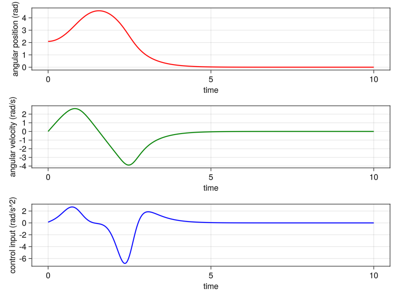
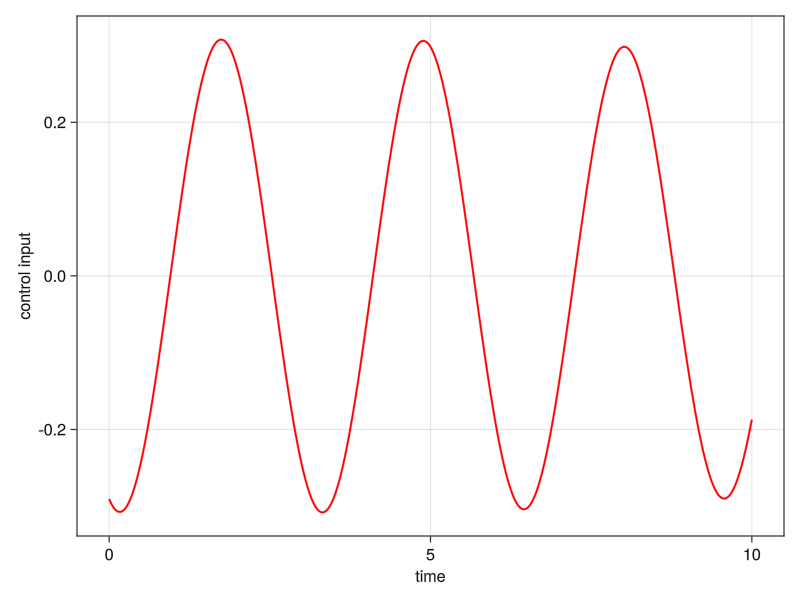
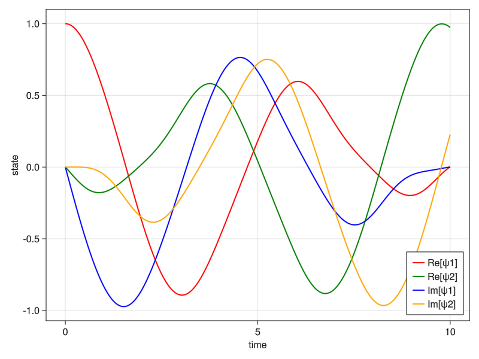

# PRONTO.jl
Hello and welcome to the julia implementation of the **PR**ojection-**O**perator-Based **N**ewton’s Method for **T**rajectory **O**ptimization (PRONTO).

PRONTO is a Newton-based method for solving trajectory optimization problems in the form
```math
\min\quad m(x(T)) + \int^T_0 l(x(t),u(t),t) dt \\s.t. \quad \dot{x} = f(x,u,t), \qquad x(0) = x_0,
```
where $t\in[0,T]$ is time, $x\in\mathbb R^n$ and $u\in\mathbb R^m$ are the state and input vectors, $x_0\in\mathbb R^n$ is the initial condition, $f:\mathbb R^n\times\mathbb R^m\times[0,T]\to\mathbb R^n$ is the dynamic model, and $l:\mathbb R^n\times\mathbb R^m\times[0,T]\to\mathbb R$ and $m:\mathbb R^n\to\mathbb R$ are the incremental and terminal costs.
The key element of PRONTO is the _projection operator_, which tranforms any pair of state and input curves $[\alpha(t),\mu(t)]$ into a trajectory $[x(t),u(t)]$ that satisfies $\dot x = f(x,u,t)$ and $x(0)=x_0$. This is achieved by solving the differential equation
```math
\begin{cases}
\dot{x} = f(x,u,t), \qquad x(0) = x_0,\\
u=\mu-K_r(t)(x-\alpha),
\end{cases} 
```
where $K_r(t)$ is a time-varying feedback gain used to stabilize the trajectory $[x(t),u(t)]$ around the initial curves $[\alpha(t),\mu(t)]$. To compute $K_r(t)$, PRONTO.jl solves the Differential Riccati Equation
```math
\begin{cases}
-\dot{P}_r = A_\eta(t)^\top P_r+P_rA_\eta(t)-K_r^\top R_r(t) K_r + Q_r(t), \qquad P(T) = P_T,\\
~~K_r=R_r(t)^{-1}B_\eta(t)^\top P_r,
\end{cases} 
```
where $A_\eta(t),B_\eta(t)$ are the linearized dynamics (linearized around $[\alpha(t),\mu(t)]$). To use PRONTO, the user must provide suitable regulator matrices $Q_r(t),R_r(t)$ and terminal condition $P_T$. Since $K_r(t)$ plays a vital role in stabilizing the solution estimates, the choice of $Q_r(t),R_r(t)$ and $P_T$ is crucial to the covergence of PRONTO, especially for systems with unstable dynamics.

## Double Integrator
WIP
## Inverted Pendulum
This example showcases PRONTO's ability to:
1) steer the system to an **unstable** equilibrium point, 
2) handle **non-convex** cost functions,
3) use the **desired target** as an initial guess. 

Consider the dynamics of an inverted pendulum
```math
f(x,u,t)= \begin{bmatrix}x_2 \\\frac{g}{L}\sin{x_1} - \frac{u}{L}\cos{x_1}\end{bmatrix},
```
where $x_1$ is the angular position, $x_2$ is the angular velocity, and $u$ is the horizontal acceleration of the fulcrum. The length of the pendulum $L$ and the gravitional acceleration $g$ will be treated as parameters. 

To steer the pendulum to the upright position, we define the terminal cost
```math
m(x) = 1-\cos(x_1)+\tfrac12x_2^2.
```
This non-convex function is zero if and only if $x=[2k\pi~~0]^\top$, with $k\in\mathbb Z$.

To limit the control effort during the transient $[0,T]$, we define the incremental cost
```math
l(x) = \tfrac12\rho u^2,
```
where $\rho>0$ is an additional parameter of the OCP.

Having fully defined our problem, we begin our code by loading a few dependencies
```julia
using PRONTO
using LinearAlgebra
using StaticArrays
using Base: @kwdef
```

To build our OCP, we decide to name our model `InvPend`. The `{2,1}` captures the fact that we have two states, $x\in\mathbb R^2$, and one control input, $u\in\mathbb^1$. The parameters of this model are the length of the pendulum `L`, the gravitional acceleration `g`, and the control effort penalty `ρ`. We provide nominal values for each parameter.
```julia
@kwdef struct InvPend <: Model{2,1} 
    L::Float64 = 2 
    g::Float64 = 9.81 
    ρ::Float64 = 1
end
```
The next step is to define the dynamics $f(x,u,t)$, the incremental cost $l(x,u,t)$, and the terminal cost $m(x)$.
```julia
@define_f InvPend [ 
    x[2], 
    g/L*sin(x[1])-u[1]*cos(x[1])/L,
    ]
@define_l InvPend 1/2*ρ*u[1]^2
@define_m InvPend 1-cos(x[1])+x[2]^2/2
```
We must now select the LQR matrices used by the projection operator. Since the linearized system is always controllable, we limit ourselves to choosing `Qr` and `Rr`. By doing so, we allow PRONTO to automatically compute the terminal conditions `PT` by linearizing the dynamics around $x(T)$ and solving the Algebraic Riccati Equation.
```julia
@define_Qr InvPend diagm([10, 1])
@define_Rr InvPend diagm([1e-3])
```
Note that, since the target equilibrium is unstable, we selected a very small input penalty $R_r$. This ensures that the regulator gain $K_r(t)$ will prioritize the angular position error (which has the highest cost) when updating the solution estimate.

The last step in the problem definition is to call `resolve_model` to instantiate PRONTO. Since we're interested in seeing how the solution estimate $x(t)$ changes from one iteration to the next, we ask PRONTO to output an ascii plot of `ξ.x` after every iteration.
```julia
resolve_model(InvPend)
PRONTO.preview(θ::InvPend, ξ) = ξ.x
```
We are now ready to solve our OCP! To do so, we load the parameters `θ`, the time horizon `τ`, and the inital condition `x0`. Here, we will be using the default value of all our parameters (defined in `InvPend`). If we wanted to solve our OCP on Mars, we could instead call `θ = InvPend(g=3.71,ρ=10)`, where we've increased the input penalty to account for the reduced gravity.
```julia
θ = InvPend() 
τ = t0,tf = 0,10
x0 = @SVector [2π/3;0]
```
Next, we need to provide PRONTO with an initial guess. Since we wish to steer the pendulum to the upright position, we use the desired equilibrium as an initial guess. Our initial state and input estimates are $\alpha(t)=[0~~0]^\top$ and $u(t)=0$, respectively, $\forall t\in[0,T]$. Note that this initial guess is not a suitable OCP solution because $\alpha(0)\neq x_0$. 
```julia
μ = t->[0]
α = t->[0;0]
```
We then call the projection operator to turn our guess `α`,`μ` into a trajectory `η`. This step ensures (among other things) that the error `η.x(0)-x0` is within machine tolerance.
```julia
η = closed_loop(θ,x0,α,x,τ)
```
It is now time to call PRONTO and solve our OCP to a tolerance of $10^{-3}$
```julia
ξ,data = pronto(θ,x0,η,τ; tol=1e-3);
```
Finally, we plot our results
```julia
# Code for plotting please!
```


## Qubit: State to State Transfer
We consider the Schrödinger equation
```math
i|\dot{\psi}(t)\rangle = (\mathcal{H_0} + \phi(t)\mathcal{H_1})|\psi(t)\rangle,
```
where $\mathcal{H_0} = \sigma_z = \begin{bmatrix}0 & 1 \\1 & 0\end{bmatrix}$, and $\mathcal{H_1} = \sigma_y = \begin{bmatrix}0 & -i \\i & 0\end{bmatrix}$ are the Pauli matrices. The real control input $\phi(t)$ drives the system between 2 qubit states $|0\rangle$ and $|1\rangle$, which are the two eigenstates of the free Hamiltonian $\mathcal{H_0}$. We wish to find the optimal control input $\phi^{\star}(t)$ that performs the state-to-state transfer from $|0\rangle$ to $|1\rangle$. To do this, we will solve:
```math
\min h(\xi) = p(x(T)) + \int^T_0 l(x(t),u(t),t) dt \\s.t. \quad \dot{x} = f(x,u,t), x(0) = x_0,\\\text{where:} \quad \xi(\cdot) = [x(\cdot);u(\cdot)]
```
First, we load some dependencies:
```julia
using PRONTO
using LinearAlgebra
using StaticArrays
using Base: @kwdef
```
Note that $|\psi \rangle$ is a $2 \times 1$ complex vector, and we wish to have the state vector $x$ in the real form. We can define our state vector 
```math
x = \begin{bmatrix}Re(|\psi\rangle)\\Im(|\psi\rangle) \end{bmatrix},
``` 
which in this case is a $4 \times 1$ vector of real numbers. Moreover, any complex square matrix $\mathcal{H}$ can be represented in its real form:
```math
H_{re} = \begin{bmatrix}Re(\mathcal{H}) & -Im(\mathcal{H}) \\Im(\mathcal{H}) & Re(\mathcal{H})\end{bmatrix}.
```
We can convert the the Schrödinger equation$i|\dot{\psi}(t)\rangle = (\mathcal{H_0} + \phi(t)\mathcal{H_1})|\psi(t)\rangle$ into the system dynamics 
```math
\dot{x}(t) = H(u)x = \begin{bmatrix}0 & 0 & 1 & 0 \\0 & 0 & 0 & -1\\-1 & 0 & 0 & 0\\0 & 1 & 0 & 0\end{bmatrix}x + u\begin{bmatrix}0 & -1 & 0 & 0 \\1 & 0 & 0 & 0\\0 & 0 & 0 & -1\\0 & 0 & 1 & 0\end{bmatrix}x.
```

We decide to name our model `TwoSpin`, where `{4,1}` represents the 4 state vector $x (|\psi\rangle)$, and the single input $u (\phi)$. For this example, our parameter is `kl`, which is a scalar that penilize the control effort.
```julia
@kwdef struct TwoSpin <: Model{4,1} 
    kl::Float64 = 0.01
end
```
First, we can define our dynamics $f$
```julia
@define_f TwoSpin begin 
    H0 = [0 0 1 0;0 0 0 -1;-1 0 0 0;0 1 0 0] 
    H1 = [0 -1 0 0;1 0 0 0;0 0 0 -1;0 0 1 0] 
    (H0 + u[1]*H1)*x
end
```
For our incremental cost $l$, we simpy penilize the control effort $u$
```julia
@define_l TwoSpin begin 
    1/2*u'*kl*u
end
```
For this example, the control objective is to steer the system from the $|0\rangle = [1, 0]^T$ state to the target state $|1\rangle = [0, 1]^T$. We can then define our terminal cost function $m$ as 
```math
m(x(T)) = \frac{1}{2} x^T(T)|P|x(T), P=\begin{bmatrix}1 & 0 & 0 & 0 \\0 & 0 & 0 & 0\\0 & 0 & 1 & 0\\0 & 0 & 0 & 0\end{bmatrix}
```
to penilize both real and imaginal parts for $|0\rangle$.
```julia
@define_m TwoSpin begin 
    Pl = [1 0 0 0;0 0 0 0;0 0 1 0;0 0 0 0] 
    1/2*x'*Pl*x
end
```

For this example, a Linear-Quadratic Regulator (LQR) is used and designed in this way:
```math
R_r(t) = I,\\Q_r(t) = I ,\\P_r(T) = Q_r(T) = I.
``` 
```julia
@define_Q TwoSpin I(4)
@define_R TwoSpin I(1)
PRONTO.Pf(θ::TwoSpin, αf, μf, tf) = SMatrix{4,4,Float64}(I(4))
```
Last we compute the Lagrange dynamics $L = l + \lambda^Tf$.
```julia
resolve_model(InvPend)
```
We now can solve the OCP! This time, we assume our guess input $\mu(t)=0.4\sin{t}$ and initialize our solver by computing the open loop system.
```julia
θ = TwoSpin() 
τ = t0,tf = 0,10 
x0 = @SVector [1.0, 0.0, 0.0, 0.0] 
xf = @SVector [0.0, 1.0, 0.0, 0.0] 
μ = t->SVector{1}(0.4*sin(t)) 
η = open_loop(θ, x0, μ, τ) 
ξ,data = pronto(θ, x0, η, τ;tol=1e-4);
```


If you do this right, you should get:
The top figure is the optimal control input $u(t)$, while the bottom figure is the state vector $x(t)$ evolves in time. We wish to check if we achieve our control objective, which is to steer the system from $|0\rangle$ to $|1\rangle$, the evolution in time of population is shown below 

## Qubit: Pauli X Gate
We consider a 3-level fluxionium qubit, whose Hamiltonian can be written as
```math
H(u)=H_0 + uH_{\text{drive}} = \begin{bmatrix}0 & 0 & 0 \\0 & 1.0 &0\\0 & 0 & 5.0\end{bmatrix} + u\begin{bmatrix}0 & 0.1 & 0.3 \\0.1 & 0 & 0.5\\0.3 & 0.5 & 0\end{bmatrix},
```
where $H_0$ is the free Hamiltonian, $H_{\text{drive}}$ is the control Hamiltonian, and $u(t)$ is the control input. We wish to find the optimal control input $u^{\star}(t)$ that performs the X gate for this qubit, that is, $u^{\star}(t)$ steers $|0\rangle=[1,0,0]^T$ to $|1\rangle=[0,1,0]^T$, while simultaneously steers $|1\rangle$ to $|0\rangle$. Meanwhile, we wish to aviod the undesirade state, which is the third state of the system.

First, we load some dependencies:
```julia
using PRONTO
using LinearAlgebra
using StaticArrays
using Base: @kwdef
```
Then we define a helper function `mprod` converting a complex matrix to its real representation  
```julia
function mprod(x)
    Re = I(2)
    Im = [0 -1;
          1 0]
    M = kron(Re,real(x)) + kron(Im,imag(x))
    return M
end
```

We decide to name our model `XGate3`, where `{12,1}` represents the 12 states vector $x ([|\psi_1\rangle, |\psi_2\rangle]^T)$, and the single input $u$. For this example, our parameters are `kl`, which is a scalar that penilize the control effort, and `kq`, which is a scalar that penilize the undesirade population.
```julia
@kwdef struct XGate3 <: PRONTO.Model{12,1}
    kl::Float64 = 0.01
    kq::Float64 = 0.5
end
```
First, we can define our dynamics $f$
```julia
@define_f XGate3 begin
    E0 = 0.0
    E1 = 1.0
    E2 = 5.0
    H0 = diagm([E0, E1, E2])
    H00 = kron(I(2),H0)
    a1 = 0.1
    a2 = 0.5
    a3 = 0.3
    Ω1 = a1 * u[1]
    Ω2 = a2 * u[1]
    Ω3 = a3 * u[1]
    H1 = [0 Ω1 Ω3; Ω1 0 Ω2; Ω3 Ω2 0]
    H11 = kron(I(2),H1)
    return 2 * π * mprod(-im * (H00 + H11)) * x
end
```
For our incremental cost $l$, we penilize both the control effort $u$ and undesirade third state
```julia
@define_l XGate3 begin
    kl/2*u'*I*u + kq/2*x'*mprod(diagm([0,0,1,0,0,1]))*x
end
```
For this example, the control objective is to steer the system from the $|0\rangle = [1, 0, 0]^T$ state to the target state $|1\rangle = [0, 1, 0]^T$, while simultaneously steers $|1\rangle$ to $|0\rangle$. We can then define our terminal cost function $m$ as 
```math
m(x(T)) = \|\psi_1(T)-|1\rangle\|^2 + \|\psi_2(T)-|0\rangle\|^2.
```

```julia
@define_m XGate3 begin
    ψ1 = [1;0;0]
    ψ2 = [0;1;0]
    xf = vec([ψ2;ψ1;0*ψ2;0*ψ1])
    return 1/2*(x-xf)'*I(12)*(x-xf)
end
```

For this example, a Linear-Quadratic Regulator (LQR) is used and designed in this way:
```math
R_r(t) = I,\\Q_r(t) = I ,\\P_r(T) = Q_r(T) = I.
``` 
```julia
@define_Qr XGate3 I(12)
@define_Rr XGate3 I(1)
PRONTO.Pf(θ::XGate3,α,μ,tf) = SMatrix{12,12,Float64}(I(12))
```
Last we compute the Lagrange dynamics $L = l + \lambda^Tf$.
```julia
resolve_model(InvPend)
```
We now can solve the OCP! This time, we assume our guess input $\mu(t)=\frac{\pi}{T}e^{...}\cos{(2\pi t)}$ and initialize our solver by computing the open loop system.
```julia
θ = XGate3()
τ = t0,tf = 0,10
ψ1 = [1;0;0]
ψ2 = [0;1;0]
x0 = SVector{12}(vec([ψ1;ψ2;0*ψ1;0*ψ2]))
μ = t->SVector{1}((π/tf)*exp(-(t-tf/2)^2/(tf^2))*cos(2*π*1*t))
η = open_loop(θ, x0, μ, τ) # guess trajectory
ξ,data = pronto(θ, x0, η, τ;tol=1e-4); # optimal trajectory
```
## Lane Change